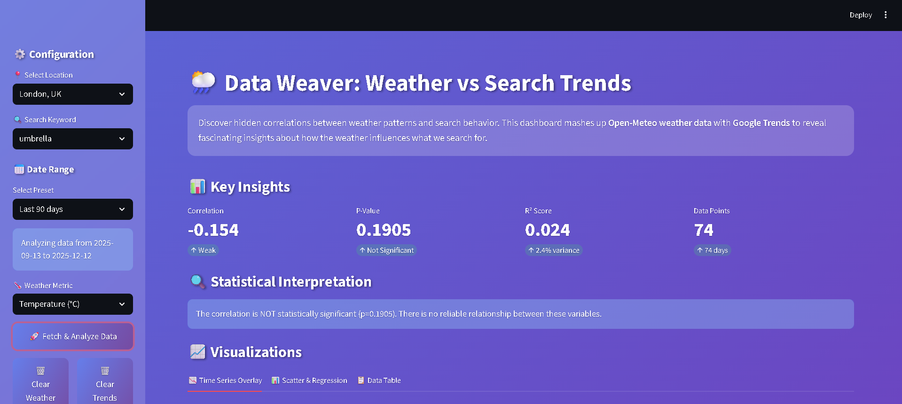
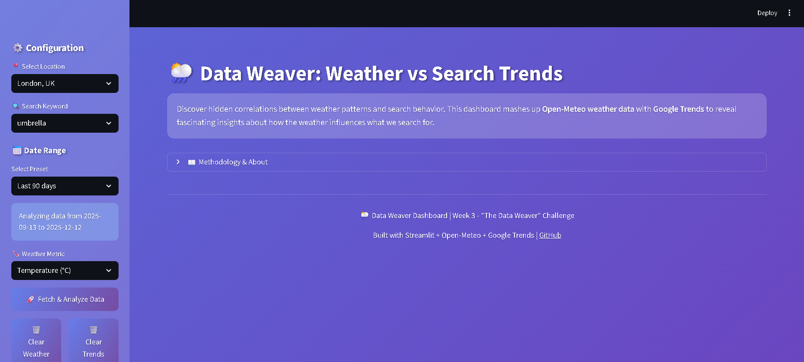
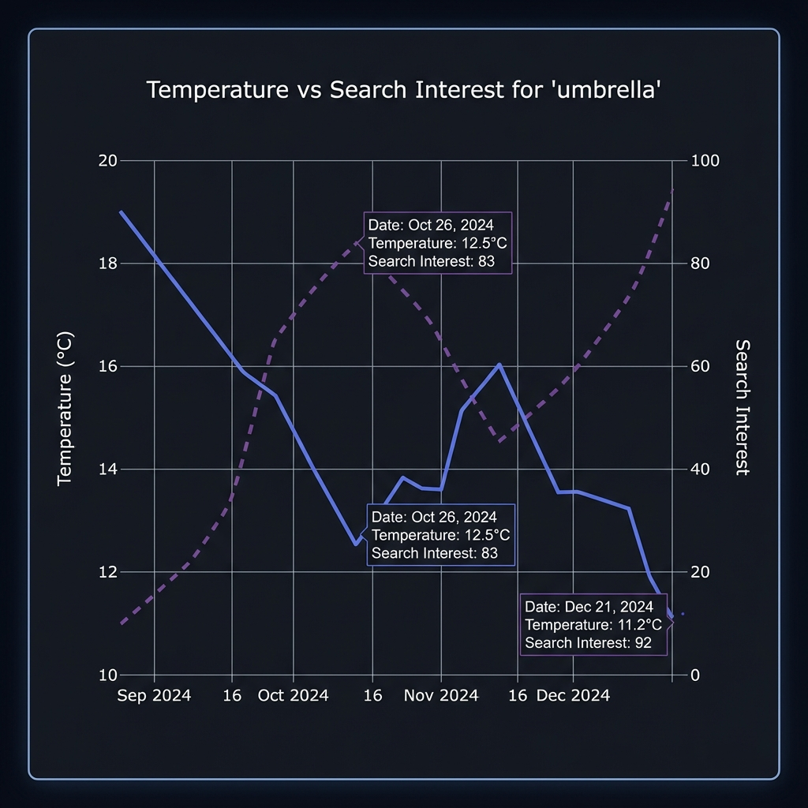
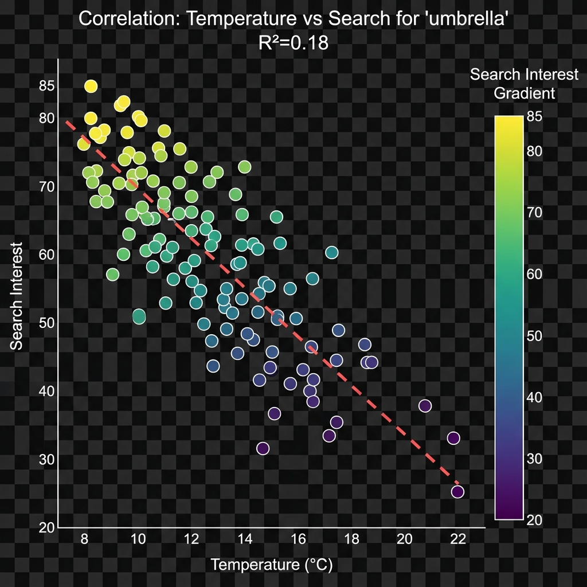

# 🌦️ Data Weaver - Weather vs Search Trends Dashboard

[](https://github.com/udaykumar0515/Kiro_Week_3_Challenge/actions)
[](https://www.python.org/downloads/)
[](https://streamlit.io)
[](https://opensource.org/licenses/MIT)

> **Week 3 Challenge: "The Data Weaver"** - Mashing up unrelated public data sources to discover hidden correlations



## 🎯 Overview

**Data Weaver** is an interactive dashboard that combines **weather data from Open-Meteo** and **search trends from Google Trends** to reveal fascinating correlations between meteorological conditions and human search behavior.

**Key Question:** Does the weather influence what we search for online?

**Hypothesis:** Weather patterns (temperature, precipitation, cloud cover) correlate with search interest for weather-related keywords like "umbrella," "ice cream," "heating," etc.

## ✨ Features

- **📊 Interactive Dashboard:** Built with Streamlit for real-time data exploration
- **🌍 Multiple Locations:** Pre-configured major cities worldwide
- **🔍 Customizable Keywords:** Analyze any search term against weather patterns
- **📈 Statistical Analysis:**
  - Pearson correlation coefficient with p-value
  - Linear regression with R² score
  - Visual interpretation of relationships
- **📉 Rich Visualizations:**
  - Time series overlay charts
  - Scatter plots with regression lines
  - Interactive filters and controls
- **💾 Smart Caching:** Reduces API calls with intelligent cache management
- **🐳 Docker Support:** One-command deployment
- **🧪 Test Suite:** Comprehensive pytest coverage
- **🔄 CI/CD Pipeline:** Automated testing and Docker builds

## 🚀 Quick Start

### Prerequisites

- Python 3.10 or higher
- Git
- Docker (optional, for containerized deployment)

### Local Installation

1. **Clone the repository:**

```bash
git clone https://github.com/udaykumar0515/Kiro_Week_3_Challenge.git
cd Kiro_Week_3_Challenge
```

2. **Create and activate virtual environment:**

```bash
# Windows
python -m venv venv
venv\Scripts\activate

# Linux/Mac
python3 -m venv venv
source venv/bin/activate
```

3. **Install dependencies:**

```bash
pip install -r requirements.txt
```

4. **Run the dashboard:**

```bash
streamlit run app/dashboard.py
```

5. **Open your browser:**

Navigate to `http://localhost:8501`

### Docker Deployment

**Quick start with Docker Compose:**

```bash
docker-compose up --build
```

Dashboard will be available at `http://localhost:8501`

**Manual Docker build:**

```bash
docker build -t data-weaver:latest .
docker run -p 8501:8501 data-weaver:latest
```

## 📁 Project Structure

```
Kiro_Week_3_Challenge/
├── app/
│   ├── dashboard.py          # Main Streamlit dashboard
│   ├── weather_fetcher.py    # Open-Meteo API client
│   ├── trends_fetcher.py     # Google Trends client (pytrends)
│   └── data_processor.py     # Data processing & statistics
├── tests/
│   ├── test_weather_fetcher.py
│   └── test_data_processor.py
├── .kiro/
│   ├── agent_log.md          # Detailed agent action log
│   ├── kiro_run_config.json  # Configuration metadata
│   ├── screenshots/          # Dashboard screenshots
│   └── commit_history.md     # Commit timeline
├── .github/
│   └── workflows/
│       └── ci.yml            # GitHub Actions pipeline
├── assets/                   # Images for documentation
├── data/
│   └── cache/               # API response cache
├── Dockerfile
├── docker-compose.yml
├── requirements.txt
├── .env.sample
├── README.md
├── DETAILS.md               # Comprehensive documentation
└── blog.md                  # AWS Builder Center blog draft
```

## 🧪 Running Tests

```bash
# Run all tests
pytest tests/ -v

# Run with coverage
pytest tests/ -v --cov=app --cov-report=html

# Open coverage report
# Coverage report will be in htmlcov/index.html
```

## 📊 Data Sources

### 1. Open-Meteo Weather API

- **URL:** https://api.open-meteo.com/
- **License:** CC BY 4.0
- **Data:** Hourly weather (temperature, precipitation, cloud cover, wind speed)
- **Rate Limit:** 10,000 requests/day (free tier)
- **Authentication:** None required

### 2. Google Trends (via pytrends)

- **Library:** pytrends (unofficial Google Trends API)
- **License:** Apache 2.0
- **Data:** Search interest over time (0-100 scale)
- **Rate Limit:** Respectful delays implemented
- **Authentication:** None required

## 🔧 Configuration

Copy `.env.sample` to `.env` and customize:

```bash
CACHE_DIR=data/cache
DEFAULT_LOCATION=London
DEFAULT_LATITUDE=51.5074
DEFAULT_LONGITUDE=-0.1278
DEFAULT_KEYWORD=umbrella
CACHE_EXPIRY_HOURS=24
TRENDS_CACHE_DAYS=7
```

## 📈 Statistical Methods

- **Pearson Correlation:** Measures linear relationship strength (-1 to +1)
- **P-Value:** Statistical significance (p < 0.05 = significant)
- **Linear Regression:** Models relationship as y = mx + b
- **R² Score:** Proportion of variance explained (0 to 1)

## 🎨 Screenshots

### Dashboard Overview



### Time Series Analysis



### Correlation Analysis



## 🤖 How Kiro Accelerated Development

This project was built with assistance from **Kiro AI Agent**, which automated:

1. **Project Scaffolding:** Created complete directory structure
2. **Data Fetchers:** Wrote weather and trends API clients with caching
3. **Dashboard UI:** Built Streamlit interface with premium design
4. **Statistical Analysis:** Implemented correlation and regression calculations
5. **Test Suite:** Generated comprehensive pytest tests
6. **Docker Setup:** Created Dockerfile and docker-compose.yml
7. **CI/CD Pipeline:** Set up GitHub Actions workflow
8. **Documentation:** Generated DETAILS.md, blog.md, and agent logs

See `.kiro/agent_log.md` for detailed action log.

## 📚 Documentation

- **[DETAILS.md](DETAILS.md)** - Comprehensive project documentation
- **[blog.md](blog.md)** - AWS Builder Center blog post draft
- **[.kiro/agent_log.md](.kiro/agent_log.md)** - Agent action log

## 🚢 Deployment Options

### Streamlit Cloud (Recommended)

1. Fork this repository
2. Sign up at [share.streamlit.io](https://share.streamlit.io)
3. Deploy from GitHub
4. Set secrets if needed

### Render

1. Create account at [render.com](https://render.com)
2. New Web Service from GitHub
3. Select this repository
4. Deploy with Docker

### Heroku

1. Install Heroku CLI
2. `heroku create`
3. `git push heroku main`

## 🐛 Known Issues & Limitations

- **Google Trends Rate Limiting:** May encounter rate limits with frequent queries; cache mitigates this
- **Historical Data Limit:** Open-Meteo free tier has limits on historical data range
- **Timezone Handling:** All times converted to UTC for consistency
- **Mobile Responsiveness:** Dashboard optimized for desktop; mobile view may vary

## 🤝 Contributing

Contributions welcome! Please:

1. Fork the repository
2. Create a feature branch (`git checkout -b feature/amazing-feature`)
3. Commit changes (`git commit -m 'feat: add amazing feature'`)
4. Push to branch (`git push origin feature/amazing-feature`)
5. Open a Pull Request

## 📄 License

This project is licensed under the MIT License - see the LICENSE file for details.

## 👤 Author

**Uday Kumar**

- GitHub: [@udaykumar0515](https://github.com/udaykumar0515)
- Repository: [Kiro_Week_3_Challenge](https://github.com/udaykumar0515/Kiro_Week_3_Challenge)

## 🙏 Acknowledgments

- **Open-Meteo** for providing free weather data API
- **Google Trends** for search interest data
- **Kiro AI** for accelerating development
- **Streamlit** for the amazing dashboard framework

---

**Built for Kiro Week 3 Challenge: "The Data Weaver" 🌦️🔍**

_Last updated: 2025-12-12_
